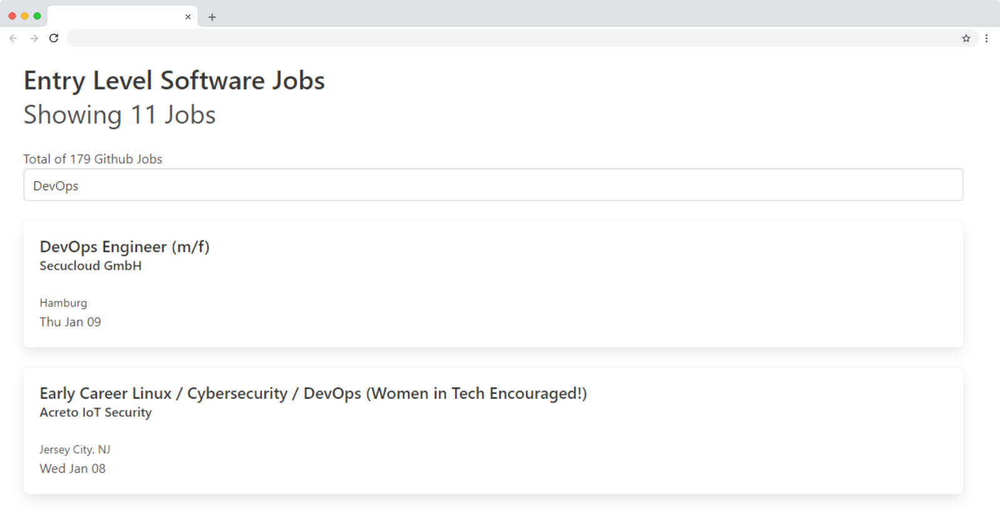

# DevJobs

Find Entry Level Developers Jobs on Github


## 🔨 Technologies used

- [React](http://reactjs.org/) for Front-end
- [Node.js](https://nodejs.org/en/) for Back-end
- [Redis](https://redis.io/) for caching
- [Docker](https://docs.docker.com/) for containerization

## 🚀 Quick Start

### Pre-requisites

- [Node.js](https://nodejs.org/en/) version 10.0 or greater
- [Docker](https://docs.docker.com/) and docker-compose

### Installation

```bash
$ yarn
$ cd client && yarn && yarn build
```

### Usage

### Start Containers

```bash
$ docker-compose up --build
```

> Open http://localhost:3000 in your browser

## 📝License

This project is licensed under the [MIT License](https://github.com/jeferson-sb/devjobs/blob/master/LICENSE.md)
